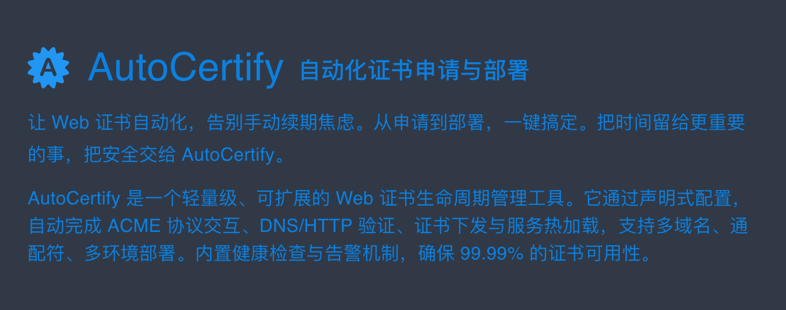

# AutoCertify

### 当前支持

| 证书签发机构  | 域名验证平台 | Web服务器 |
|---------------|--------------|-----------|
| Let's Encrypt | Aliyun       | IIS       |

### 运行环境

- .NET 10.0 [前往下载](https://dotnet.microsoft.com/en-us/download/dotnet/10.0)
- ASP.NET Core 10.0 [前往下载](https://dotnet.microsoft.com/en-us/download/dotnet/10.0)
- PowerShell Core [前往下载](https://github.com/PowerShell/PowerShell/releases)

### 如何使用

- #### Windows
    - 访问 https://auto-certify.liyanjie.net 下载程序包并解压
    - 使用 PowerShell 运行 install.ps1 安装服务
    - 访问 http://localhost:17443 打开管理界面
    - 配置证书

- #### MacOs
    - 敬请期待

- #### Linux
    - 敬请期待

### 用户协议

- [《用户协议》](./user-agreement.md "用户协议")
